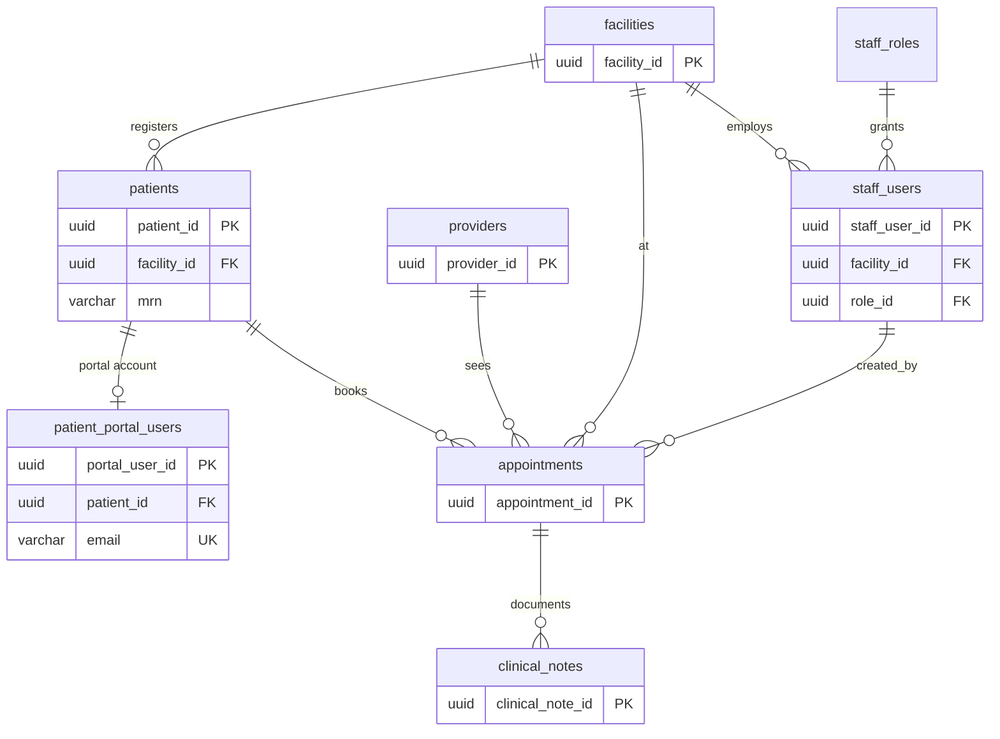

# Postgres EHR Architecture

PostgreSQL schema definitions for a small electronic health record (EHR) system. The project is SQL-first: each object lives under `schema/`, intended to be applied manually or wired into a migration tool later.

## Overview

The model covers core clinical and operational entities with HIPAA-oriented safeguards at the database layer (audit logging, facility scoping, row-level security, and separation of staff vs. portal accounts).

| Table | Purpose |
|-------|---------|
| `facilities` | Care sites (hospital, clinic, urgent care, virtual) |
| `staff_roles` | Role codes for least-privilege staff access |
| `staff_users` | Staff EHR accounts (scoped to a facility) |
| `patients` | Demographics and contact info (scoped by `facility_id`) |
| `patient_portal_users` | Patient portal credentials (one account per patient) |
| `providers` | Clinicians with NPI, license, specialty, and contact details |
| `appointments` | Scheduled visits linking patient, provider, and facility |
| `clinical_notes` | Clinical/administrative narrative PHI (linked to appointments) |
| `audit_log` | Append-only change log for PHI tables |

All primary keys use `UUID` with `gen_random_uuid()` (requires the `pgcrypto` extension, or PostgreSQL 13+ built-in `gen_random_uuid()`).

## Entity relationships



## Project layout

```
schema/
├── database/
│   └── ehr.sql
├── functions/
│   ├── set_updated_at.sql
│   └── record_phi_audit.sql
├── tables/
│   ├── facilities.sql
│   ├── staff_roles.sql
│   ├── staff_users.sql
│   ├── audit_log.sql
│   ├── providers.sql
│   ├── patients.sql
│   ├── patient_portal_users.sql
│   ├── appointments.sql
│   └── clinical_notes.sql
├── triggers/
│   └── phi_audit_triggers.sql
└── policies/
    └── row_level_security.sql
seed/
├── facilities.sql
├── staff_roles.sql
├── staff_users.sql
├── providers.sql
├── patients.sql
├── patient_portal_users.sql
├── appointments.sql
├── clinical_notes.sql
├── audit_log.sql
└── seed.sql
scripts/
└── setup_database.py
.env.example
requirements.txt
```

## Prerequisites

- PostgreSQL 14+ recommended
- Python 3.10+ with a virtual environment
- A PostgreSQL superuser or database owner account (default: `postgres` on `localhost`)

## Set up the database (Python)

The setup script creates `ehr_db`, applies all schema SQL in dependency order, and loads seed data from `seed/`.

```bash
# Create and activate a virtual environment
python3 -m venv .venv
source .venv/bin/activate

# Install dependencies
pip install -r requirements.txt

# Copy connection settings and edit as needed
cp .env.example .env

# Run setup (reads .env from the project root)
python scripts/setup_database.py
```

Connection settings are loaded from `.env` in the project root (see `.env.example`). They map to standard [libpq environment variables](https://www.postgresql.org/docs/current/libpq-envars.html):

| Variable | Default | Purpose |
|----------|---------|---------|
| `PGHOST` | `localhost` | PostgreSQL host |
| `PGPORT` | `5432` | PostgreSQL port |
| `PGUSER` | `postgres` | Role used to connect |
| `PGPASSWORD` | *(empty)* | Password for `PGUSER` |
| `EHR_DB_NAME` | `ehr_db` | Target database name |

Example `.env`:

```env
PGHOST=localhost
PGUSER=postgres
PGPASSWORD=yourpassword
```

Optional flags:

```bash
python scripts/setup_database.py --schema-only   # schema only, no seed data
python scripts/setup_database.py --seed-only     # seed only (schema must exist)
python scripts/setup_database.py --db-name my_ehr_db
```

If `en_US.UTF-8` is unavailable on your system, the script falls back to server-default locale when creating the database.

## Apply the schema manually (psql)

Alternatively, from a superuser or database owner session:

```bash
# Create the database (optional; edit locale if needed)
psql -U postgres -f schema/database/ehr.sql

# Enable UUID generation if not already available
psql -U postgres -d ehr_db -c "CREATE EXTENSION IF NOT EXISTS pgcrypto;"

# Functions
psql -U postgres -d ehr_db -f schema/functions/set_updated_at.sql
psql -U postgres -d ehr_db -f schema/functions/record_phi_audit.sql

# Tables (dependency order)
psql -U postgres -d ehr_db -f schema/tables/facilities.sql
psql -U postgres -d ehr_db -f schema/tables/staff_roles.sql
psql -U postgres -d ehr_db -f schema/tables/staff_users.sql
psql -U postgres -d ehr_db -f schema/tables/audit_log.sql
psql -U postgres -d ehr_db -f schema/tables/providers.sql
psql -U postgres -d ehr_db -f schema/tables/patients.sql
psql -U postgres -d ehr_db -f schema/tables/patient_portal_users.sql
psql -U postgres -d ehr_db -f schema/tables/appointments.sql
psql -U postgres -d ehr_db -f schema/tables/clinical_notes.sql

# Audit triggers and RLS (after all tables)
psql -U postgres -d ehr_db -f schema/triggers/phi_audit_triggers.sql
psql -U postgres -d ehr_db -f schema/policies/row_level_security.sql
```

If you already have a target database, skip `ehr.sql` and run the remaining files in the order above.

To load seed data manually after the schema is applied:

```bash
psql -U postgres -d ehr_db -f seed/seed.sql
```

## Session context (application)

Set these at the start of each request/transaction for audit and RLS:

```sql
SET LOCAL app.current_facility_id = '<facility-uuid>';
SET LOCAL app.current_staff_user_id = '<staff-user-uuid>';
-- optional, for portal actions:
SET LOCAL app.current_portal_user_id = '<portal-user-uuid>';
SET LOCAL app.client_ip = '203.0.113.10';
SET LOCAL app.session_id = '<session-id>';
```

Use a non-superuser database role for the application so row-level security policies apply.

## Design notes

**Patients** — `mrn` is unique per `facility_id`. Soft deactivation via `is_active`, `deactivated_at`, and `deactivation_reason`. `is_test` flags synthetic records. `blood_type` was removed from core demographics (collect in clinical workflows if needed). `created_by` / `updated_by` reference `staff_users`.

**Staff** — `staff_users` are separate from `patient_portal_users`, with `staff_roles` for clinician and admin. Portal auth fields include MFA flag, lockout, and login timestamps.

**Patient portal** — One `patient_portal_users` row per patient. Login email is stored on the portal account; contact email remains on `patients`.

**Appointments** — Foreign keys to patients, providers, and facilities. Scheduling fields only; clinical text moved to `clinical_notes`.

**Clinical notes** — `chief_complaint`, `provider_note`, and `administrative` note types. Tighter access and audit than scheduling rows.

**Audit** — `record_phi_audit()` trigger on PHI tables writes to `audit_log`. Restrict `UPDATE`/`DELETE` on `audit_log` for application roles in production.

**Row-level security** — `patients`, `appointments`, `clinical_notes`, and `patient_portal_users` are scoped by `app.current_facility_id`.

## Status and next steps

Additional tables still planned:

- insurance
- clinical documents
- orders
- billing
- consent / release-of-information tracking
