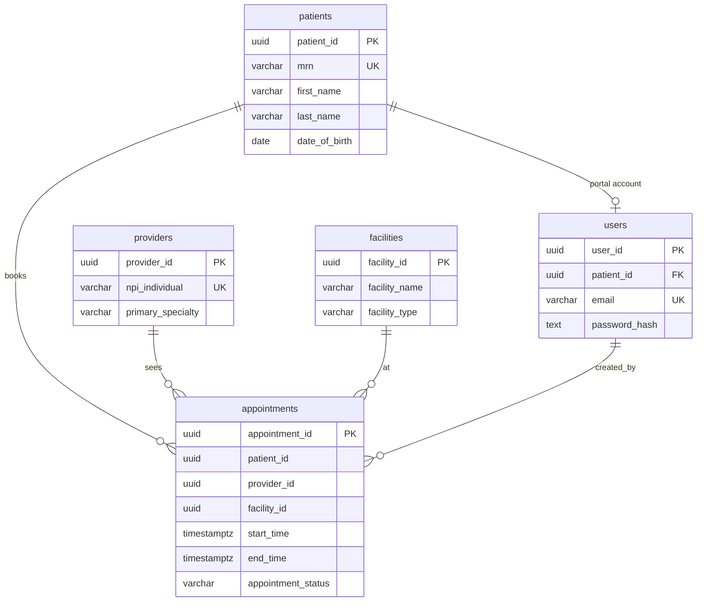

# Postgres EHR Architecture

PostgreSQL schema definitions for a small electronic health record (EHR) system. The project is SQL-first: each table lives in its own file under `schema/`, intended to be applied manually or wired into a migration tool later.

## Overview

The model covers core clinical and operational entities:

| Table | Purpose |
|-------|---------|
| `patients` | Demographics, contact info, MRN, and clinical flags |
| `users` | Patient portal credentials (one account per patient) |
| `providers` | Clinicians with NPI, license, specialty, and contact details |
| `facilities` | Care sites (hospital, clinic, urgent care, virtual) |
| `appointments` | Scheduled visits linking patient, provider, and facility |

All primary keys use `UUID` with `gen_random_uuid()` (requires the `pgcrypto` extension, or PostgreSQL 13+ built-in `gen_random_uuid()`).

## Entity relationships



`appointments` columns reference patients, providers, and facilities by UUID; foreign key constraints are not yet defined in the DDL. `users` is intended to reference `patients` with `ON DELETE CASCADE`.

## Project layout

```
schema/
├── database/
│   └── ehr.sql          # CREATE DATABASE and connect
└── tables/
    ├── patients.sql
    ├── users.sql
    ├── providers.sql
    ├── facilities.sql
    └── appointments.sql
```

## Prerequisites

- PostgreSQL 14+ recommended
- Locale `en_US.UTF-8` if you use `schema/database/ehr.sql` as written (adjust `LC_COLLATE` / `LC_CTYPE` for your environment)

## Apply the schema

From a superuser or database owner session:

```bash
# Create the database (optional; edit locale if needed)
psql -U postgres -f schema/database/ehr.sql

# Enable UUID generation if not already available
psql -U postgres -d ehr_db -c "CREATE EXTENSION IF NOT EXISTS pgcrypto;"

# Apply tables in dependency order
psql -U postgres -d ehr_db -f schema/tables/patients.sql
psql -U postgres -d ehr_db -f schema/tables/users.sql
psql -U postgres -d ehr_db -f schema/tables/providers.sql
psql -U postgres -d ehr_db -f schema/tables/facilities.sql
psql -U postgres -d ehr_db -f schema/tables/appointments.sql
```

If you already have a target database, skip `ehr.sql` and run only the `tables/*.sql` files against that database.

## Design notes

**Patients** — MRN is unique facility-wide. `sex` is constrained to a fixed set; `gender_identity` is optional free text. `is_active` supports soft retirement of merged, deceased, or test records.

**Users** — Portal logins tied to a single patient. Passwords are stored as bcrypt hashes only. An `updated_at` trigger is defined in DDL (requires a shared `set_updated_at()` function to be created before applying `users.sql`).

**Providers** — Includes NPI (10 digits), state license, optional DEA, specialty, and taxonomy. Partial index on active providers by specialty.

**Facilities** — Typed sites with address, NPI, and optional CLIA. Index supports lookups of active facilities by name.

**Appointments** — Status workflow from `Scheduled` through `Completed`, plus cancel/no-show/reschedule. `end_time` must be after `start_time`. Indexes support patient history, provider schedules, and time-range queries.

## Status and next steps

This repository is an evolving schema prototype. Additional tables include:

- insurance
- clinical documents
- orders
- billing
